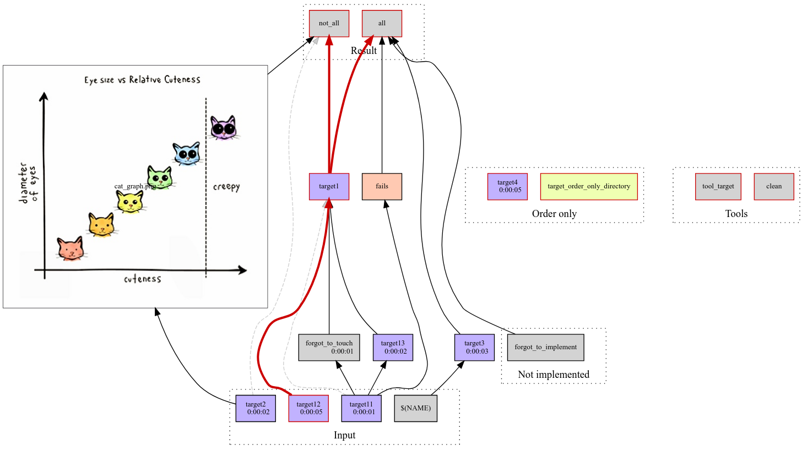

# Makefile Profiler

Helps managing a large data processing pipeline written in Makefile.

## Features

- SVG build overview (example: https://github.com/gojuno/make-profiler/blob/master/make.svg);

- Critical Path is highlighted;

- Inline pictures-targets into build overview;

- Logs for each target marked with timestamps;

- Distinguish a failed target execution from forgotten touch;

- Navigate to last run's logs from each target directly from call graph;

- Support for self-documented Makefiles according to
  http://marmelab.com/blog/2016/02/29/auto-documented-makefile.html

- Web-based dashboard to view the target statuses and monitor progress.

## Example usage

    sudo apt install python3-pip graphviz gawk
    sudo pip3 install https://github.com/konturio/make-profiler/archive/master.zip

    cd your_project
    profile_make -h                 # have a look at help

    profile_make                    # generate overview graph without profiling data
    xdg-open make.svg               # have a look at call graph

    profile_make_clean target_to_remove_with_children

    profile_make_lint               # validate Makefile to find orphan targets
    profile_make -j -k target_name  # run some target, record execution times and logs
    xdg-open make.svg               # have a look at call graph with timing data

    profile_make -a 2022-05-01      # generate overview graph with full target time only after the specified date

    profile_make_viewer -o="~/public_html"   # Create files for web-based dashboard in the public_html folder.

    
